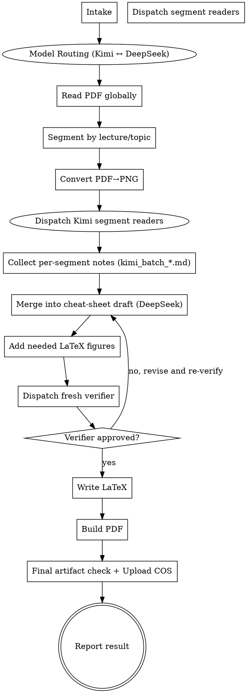

# Summarize Slides

Turn a long lecture PDF into a concise, exam-oriented LaTeX cheat sheet and compiled PDF with  bilingual terminology, and only the diagrams that materially improve understanding.

**Core principle:** treat slide summarization as a controller workflow for long documents: read globally first, segment by lecture or topic, dispatch focused readers for each segment, merge into a single cheat-sheet draft, then run a fresh coverage verifier before building final artifacts.

## Non-Negotiables

- **REQUIRED COMPANION SKILL:** use `pdf` for PDF intake and reading. This workflow is not optional.
- **NO OTHER SKILLS:** when this skill applies, use only `summarize-slides` plus `pdf`. Do **not** invoke `dispatching-parallel-agents` or any other additional skill. Any task-splitting, reader dispatch, verifier separation, or parallelization logic needed for this workflow is already defined inside this skill.
- Check that locally installed `xelatex` is available before promising the default required compiled PDF output.
- Default deliverables are `.tex` and compiled `.pdf`, with the PDF treated as the required final artifact unless the user explicitly asks not to produce it, and the default compiled PDF path requires `xelatex`.
- When this skill applies, a chat-only or inline summary is **not** a successful final deliverable unless the user explicitly asks for summary-only output or explicitly opts out of file creation.
- If the user gives parsed text, OCR text, extracted images, or page-by-page content originating from a lecture PDF instead of the raw PDF file, treat it as the same slide-summarization task and still produce the document artifacts by default.
- By default, place all generated artifacts in a single folder named `Summary - <pdf-stem>` inside the same directory that contains the source PDF. Do not scatter `.tex`, `.pdf`, helper assets, or intermediate files elsewhere.
- This containment rule is strict: create the output folder before any extraction, note-taking, OCR, or build step, and write every generated file into that folder from the start.
- Extracted text files are included in this rule. Files such as `<pdf-stem>_full.txt`, `<pdf-stem>_p1-5.txt`, OCR dumps, page-range extracts, verifier notes saved to disk, temporary LaTeX snippets, and any other intermediate `.txt`, `.md`, `.json`, `.tex`, image, or helper outputs must live inside `Summary - <pdf-stem>` only.
- Never place generated files next to the source PDF unless the user explicitly asked for that location. The source PDF's directory is not a scratch space.
- Here, `same directory that contains the source PDF` means the output folder sits alongside the PDF file itself. Example: if the source PDF is `.../lecture/foo.pdf`, the default output folder is `.../lecture/Summary - foo/`.
- The default writing style is Chinese-first.
- Important technical concepts, terms, and named distributions/theorems must include the original English in parentheses.
- Long English sentences is not acceptable
- Each summarized point should include the source slide page number or a tight page range by default. Omit citations only if an extraction failure is explicitly reported.
- The output style is `cheat sheet` in the sense of coverage, brevity, clarity, and fast lookup. It does **NOT** mean forced ultra-dense layout, automatic two-column formatting, or unreadable compression.
- Default layout is normal single-column reading unless the user explicitly asks for another layout.
- Do not produce a generic chapter summary when the user asked for exam points.
- Include formulas, important concepts, representative examples, and problem-solving techniques where they matter.
- Do not silently drop later sections of a long PDF because of context or time pressure.
- If extraction quality is too poor to preserve formulas, symbols, or page mapping, stop and ask rather than paraphrasing uncertain mathematics.
- If an important concept genuinely needs a figure to explain it clearly, include a LaTeX-drawn explanatory figure in the final document.
- By default, use slide screenshots (PNGs from `pages/` directory) for all key mechanism diagrams. This is the default and required approach. Do not ask for permission.
- Models without image recognition capabilities (such as Deepseek) must not be used for image processing tasks


## Skill Boundary

- Allowed skills for this workflow: `summarize-slides` and `pdf` only.
- Forbidden: all other skills, even if they appear relevant to planning, dispatch, verification, or writing.
- Task or subagent mechanisms may still be used when the platform supports them, but that is an execution detail and does **not** justify loading another skill.

## Required Outcome

The default successful outcome for this skill is:

- a saved LaTeX source file named `Summary - <pdf-stem>.tex`
- a compiled PDF file named `Summary - <pdf-stem>.pdf`
- all generated files grouped in one output folder named `Summary - <pdf-stem>` inside the same directory as the source PDF unless the user explicitly requested another location
- no generated intermediate, extracted-text, OCR, notes, or helper files left outside that output folder
- a final response that reports the artifact paths and any blockers encountered

If no raw PDF path is available and the input is only source-derived text, OCR, extracted images, or page-by-page content:

- use the user-provided lecture name as the naming basis if one exists
- otherwise use the fallback stem `lecture-slides`
- default the output folder to `Summary - <chosen-stem>` in the current working directory unless the user specified another location
- name the artifacts `Summary - <chosen-stem>.tex` and `Summary - <chosen-stem>.pdf`

The following are **not** successful completions when this skill applies unless the user explicitly requested them:

- an inline chat summary only
- a summary draft that was never written to disk
- a claim that the work is complete before LaTeX was written and the PDF was compiled
- stopping at analysis, segmentation, or merged notes

## When to Use

Use this skill when the user wants any of the following from a PDF slide deck, lecture PDF, lecture notes PDF, or 课件 PDF:

- a study sheet
- a cheat sheet
- a key-points summary
- a formula sheet
- a concise review PDF
- exam-point extraction from slides
- 总结这个课件
- 把这个课件整理成复习资料
- 提炼这份 slides 的考点
- 做一个公式和概念速查表
- 做成考试前看的 cheat sheet
- 总结 lecture PDF
- 总结 slides
- 提炼课程讲义里的重点
- 使用skill总结
Common trigger words and phrases:

- 课件
- slides
- lecture PDF
- 复习资料
- 考点总结
- 总结一下这个课件
- 提炼考点
- 公式速查表
- 概念速查表
- cheat sheet
- 考前整理
- 考试重点

Requests like `总结一下这个课件` still default to the artifact-producing workflow above. Do not reinterpret them as permission to answer only in chat.

Do not use this skill for:

- homework solving
- essay writing
- article summarization where slide-page lookup is unimportant
- `.pptx` workflows that are not already exported to PDF

## Portability

- Do not assume any custom skill other than `pdf` exists.
- This skill must be used together with `pdf`. Do not replace the `pdf` skill with an ad hoc fallback.
- Do not invoke any other skill to manage parallel work, planning, verification, or subagent dispatch. In particular, do not invoke `dispatching-parallel-agents`; follow the dispatch rules written here directly.
- If subagents are available and practical, prefer them for segment readers and a separate verifier. For very long decks, this is the preferred execution path when the platform supports it reliably.
- If subagents are not available, emulate the same roles sequentially: controller pass, per-segment read pass, merge pass, verifier pass.

## Workflow Model

- the `controller` owns intake, global read, segmentation, merge, style normalization, build choice, and final reporting
- each `segment-reader` owns one lecture chunk or topic chunk only
- one fresh `verifier` checks coverage, page references, bilingual terminology, and exam usefulness after merge
- the controller never treats segment notes as already trusted final output

## Dispatch Rules

This section replaces the need for any separate parallel-dispatch skill.

- Use one reader per independent lecture segment only when the segments can be understood without shared reasoning state.
- Good split examples: chapter blocks, explicit topic-title sections, or long independent page ranges.
- Do not split tightly coupled derivations, one multi-page proof chain, or one example whose steps depend heavily on each other across pages.
- When several segments are independent, dispatch them in parallel if the platform supports parallel subagents.
- When segments are not independent, process them sequentially even if parallel execution is available.
- The verifier must be a fresh pass with fresh context. Do not reuse one of the segment readers as the verifier.
- Each dispatched reader must receive only its own page range, the fixed return format, and the instruction not to write the final document.
- After all readers return, the controller must review for conflicts, merge them, and then hand the merged draft to a separate verifier pass.

## Execution Flow



## Step 1. Intake

- Confirm the source PDF path, or if no raw PDF is available, confirm the source-derived input and the naming basis for outputs.
- Confirm the output directory if the user already specified one.
- Determine expected outputs: `.tex`, `.pdf`, or both. Default is both, and the PDF is the required final artifact unless the user explicitly opts out of PDF output.
- Determine whether the user wants the whole deck or a subset. Default is the whole deck.
- Record any style instructions already provided by the user.
- If the user did not specify an output path, create and use a deterministic folder named `Summary - <pdf-stem>` inside the same directory as the source PDF and continue rather than waiting for unnecessary clarification.
- Treat creation of that folder as the first filesystem step of the workflow. Do not write extraction files to the source PDF directory and move them later; write them into the output folder immediately.

If there is no raw PDF path, choose the output stem using the rule from `Required Outcome` and create the deterministic output folder from that stem instead of waiting for clarification.

Default style unless the user says otherwise:

- language: Chinese
- layout: single-column normal reading
- purpose: exam review
- tone: concise, clear, non-verbose
- output: `Summary - <pdf-stem>.tex` and `Summary - <pdf-stem>.pdf` inside the folder `Summary - <pdf-stem>` that sits in the same directory as the source PDF

## Step 2. Check Build Environment

- Verify `xelatex` exists before promising the default required compiled PDF.
- The default Chinese-first compiled PDF workflow requires `xelatex` for Chinese text and math.
- If `xelatex` is missing, stop and report that the environment prerequisite for the default required PDF output is missing unless the user explicitly changes the output expectation away from compiled PDF. Do not stop at `.tex` only when PDF output is still required.

## Step 3. Model Routing (Critical!)

**This is the single most important rule in this skill. Violating it causes severe user dissatisfaction.**

ask your self first, how many Model do you have and what Model you are, Whether you have ability to process with Images.

### Model Assignment
- 
- **Kimi** (`moonshot/kimi-k2.6`) — ALL image reading and analysis. Every slide/PDF page that contains visual content (diagrams, graphs, photos, screenshots, chemical structures, EM images, etc.) MUST be analyzed by Kimi.
- **DeepSeek** — ALL text processing, merging, synthesis, LaTeX generation, and verification. DeepSeek must never be used to read images directly.
- **GPT** - If using GPT, please prioritise using GPT for image processing and text analysis tasks


### Why This Matters
- DeepSeek do NOT have image analysis capability.
- Using DeepSeek to read images is NOT Acceptable.
- This routing is non-negotiable: Kimi reads pictures → DeepSeek reads text and merges.

### How to Implement
- Use `sessions_spawn` with `model="moonshot/kimi-k2.6"` for all image-reading subagents.
- If there is no `model="moonshot/kimi-k2.6"`, use GPT, if there is no GPT and Kimi, ask user first
- Batch slides in groups of **6-13 per Kimi/GPT subagent** to avoid timeout. For a 37-slide deck, use 3 batches of ~13 slides each; for very large decks up to 6 batches.
- Each Kimi subagent reads slides from disk (PNG files in `pages/` directory), produces structured Markdown analysis, and saves it to `kimi_batch_*.md` in the output folder.
- After all Kimi batches complete, spawn a DeepSeek subagent (`model="deepseek/deepseek-v4-flash"`) to read the Kimi analysis files and produce the final LaTeX + PDF.

### Example Workflow
```
PDF → pdftoppm → pages/slide-*.png
         ↓
Kimi/GPT batch 1 (slides 01-13) → kimi_batch_1.md
Kimi/GPT batch 2 (slides 14-26) → kimi_batch_2.md
Kimi/GPT batch 3 (slides 27-37) → kimi_batch_3.md
         ↓
DeepSeek/GPT reads all kimi_batch_*.md → LaTeX → xelatex → PDF
         ↓
Verifier checks coverage + image placement
         ↓
  upload → Cleanup
```

## Step 4. Read the PDF Globally First

Do not jump straight into chunk summaries.

- If any extracted text, OCR output, or saved notes are written to disk during this step, they must be written inside the output folder, never beside the source PDF.
- Read enough of the whole PDF to understand its macro-structure.
- Identify title pages, agenda pages, lecture separators, topic transitions, and summary slides.
- Build a segmentation map before deep reading.

For very long decks, segmentation plus per-segment reading is mandatory. Do not summarize a few-hundred-page deck in one shot.

Treat a deck as `very long` whenever one-pass reading would plausibly cause dropped coverage, unstable page mapping, or weak recall of later sections. In practice, any deck with a few hundred pages should be treated this way.

For long decks, the controller must first produce:

- overall topic list
- segment boundaries by page range
- expected number of lecture/topic segments
- suspected formula-heavy or concept-heavy regions
- a segmentation map covering the full page range

The segmentation map must cover all pages exactly once unless a page is explicitly marked as intentionally excluded, such as a duplicate title slide or blank separator page.

## Step 5. Segment the Deck

First check the document for a slide or section named `Learning Objectives`, `Learning Objective`, `Learning Object`, `Objectives`, `Learning outcomes`, or a close synonym.

If a Learning Objectives/Object section exists, its listed objectives must become the first-level headings of the final review document. This is mandatory. Do not replace those first-level headings with generic topic names unless an objective is too vague to be useful; in that case, preserve the objective wording and add a concise clarifying phrase.

When Learning Objectives/Objectives are used as first-level headings, translate the objective into concise Chinese topic phrasing. Do not use the original English objective sentence as the heading. Preserve the English objective only as a parenthetical gloss or nearby source note when useful; the visible heading itself must be Chinese and must remain a noun/topic phrase.

Under each Learning Objective heading, organize the relevant content with second-level subsections such as `定义`, `机制`, `实验判据`, `易错点`, or `考题判断流程`.

Headings must be concise topic noun phrases, not full sentences, questions, or instructional prompts. For example, use `突触强度的三个基本变量`, not `三个变量分别代表什么`; use `释放概率的决定因素`, not `为什么本讲重点是 p`; use `电生理记录的常用手段`, not `电生理记录：先分清“看电压”还是“看电流”`.

If there is no Learning Objectives/Object section, then check for a Table of Contents or agenda slide and use that as the first-level structure. If neither exists, use the coarsest segmentation that preserves topic integrity.

The final first-level heading order should follow the Learning Objectives order unless the user explicitly asks for another organization.

Prefer, in order:

1. lecture boundaries already present in the slides
2. explicit topic-title boundaries
3. major concept transitions

Do not split a tightly coupled derivation across multiple segment readers unless necessary.

If a segment boundary is not obvious from lecture titles or topic-title slides, record a short justification for that split.

### PDF → PNG Conversion
Before dispatching segment readers, convert each slide to PNG:
```bash
pdftoppm -png -r 150 "source.pdf" "output_folder/pages/slide"
```
- Resolution: 150 DPI (good balance of quality and size; produces 2000x1500px for standard slides)
- Higher DPI (200-300) for slides with fine text or detailed diagrams
- Files are named slide-01.png, slide-02.png, etc. inside `pages/` subfolder of the output directory
- The `pages/` directory is inside the `Summary - <pdf-stem>/` output folder, never in /tmp

### Output Folder Structure (Final State)
 if use Kimi there is the example
```
Summary - <pdf-stem>/          ← output folder, beside source PDF
├── pages/                     ← PNG files from pdftoppm
│   ├── slide-01.png
│   ├── slide-02.png
│   └── ...
├── kimi_batch_1.md            ← Kimi analysis (slides 1-N)
├── kimi_batch_2.md            ← Kimi analysis (slides N+1-M)
├── kimi_batch_3.md            ← Kimi analysis (remaining slides)
├── Summary - <pdf-stem>.tex   ← Final LaTeX source
└── Summary - <pdf-stem>.pdf   ← Compiled PDF
```

## Step 6. Segment Reader Phase (Kimi Batch Dispatch)

If subagents are available and practical, dispatch one fresh `segment-reader` per independent segment.

If subagents are not available, the controller must still create separate per-segment notes before any merged summary is written. Do not read and summarize the full deck in one fused pass.

If the proposed segments are not independent enough to read safely in parallel, keep the same per-segment structure but execute sequentially.

Each segment-reader should return exactly these sections:

- `segment id`
- `page range covered`
- `main exam points`
- `core formulas`
- `key concepts with English terms`
- `important examples or recurring problem patterns`
- `problem-solving techniques or pitfalls`
- `figure candidates if any`
- `coverage concerns or uncertainty`

Segment readers are not allowed to:

- write the final document
- decide the final layout
- skip page references casually
- collapse the work into a generic prose summary

## Step 7. Merge into Cheat-Sheet Draft (DeepSeek/GPT Phase)

The controller merges all segment notes into one coherent exam-review structure.

The target output is not a page-by-page narrative. It should be organized for fast review, typically by lecture or topic block, with concise bullets under each block.

The target output is also not a flat one-level outline. It must expose the lecture's knowledge structure and reasoning relationships. Every major topic should contain at least one second-level subsection or labeled logic block that explains how concepts connect.

Every major block should try to include:

- what to know
- formula(s)
- why it matters or when it appears in problems
- one representative example pattern if useful
- one practical solving hint if useful

For mechanism-heavy or method-heavy lectures, each major block must include the relevant causal or diagnostic chain, using a compact form such as:

- upstream cause or manipulation
- intermediate variable changed
- observable effect
- experimental evidence or caveat

Examples:

- `Ca2+ entry decreases → release probability (Pr) decreases → evoked EPSC decreases → PPR/CV/failures should be checked`
- `Current clamp measures membrane-potential effect → driving force changes near reversal potential → EPSPs are not simply additive`
- `Evoked response changes but uncaging response does not → postsynaptic sensitivity is less likely; presynaptic release is more likely`

## Style Rules for the Draft

- Write the content in Chinese by default. English-only prose is not acceptable unless the user explicitly requests English output.
- Present technical terms as `中文术语（English term）` on first use and whenever clarity matters. Do not write English terms alone when a clear Chinese term exists.
- Examples: `释放概率（release probability）`, `成对脉冲易化（paired-pulse facilitation, PPF）`, `电压钳（voltage clamp）`.
- Use the Learning Objectives/Objectives as first-level headings when present; do not create unrelated first-level headings that ignore the slide's stated learning objectives.
- Write headings as concise topic phrases or noun phrases. Do not use full sentences, question-style headings, instructional prompts, or conversational headings.
- Bad heading: `三个变量分别代表什么`; good heading: `突触强度的三个基本变量`.
- Bad heading: `为什么本讲重点是 p`; good heading: `释放概率的核心地位`.
- Bad heading: `电生理记录：先分清“看电压”还是“看电流”`; good heading: `电生理记录的常用手段`.
- Write like a concise textbook or course review chapter, not like instructions telling the reader what to do.
- Prefer objective exposition using `定义`, `机制`, `分类`, `证据`, `结论`, and `应用` style.
- Avoid reader-instruction phrasing such as `先看...`, `你要...`, `记住...`, `判断时先...`, `第一反应是...`, or `不要...`.
- Replace instructional wording with topic exposition. Example: use `电生理记录的常用手段` and explain the methods; do not write `电生理记录：先分清看电压还是看电流`.
- Explain concepts with definition-style sentences before adding description, mechanism, or caveats.
- Prefer `X 是...`, `X 指...`, `X 表示...`, `X 定义为...`.
- Avoid opening concept explanations with vague descriptive phrasing such as `可以近似理解为...`, `它常与...相关...`, or `简单来说...`.
- Bad explanation: `释放位点可以近似理解为参与 response 的有效 presynaptic release sites。`
- Good explanation: `释放位点（release site）是能够在一次 presynaptic action potential 后释放囊泡并产生 postsynaptic response 的突触前功能单位。`
- Short bullets, not large explanatory paragraphs.
- Prefer exam language like `定义`, `公式`, `判据`, `技巧`, `典型例题`, `易错点`.
- Use visible hierarchy: major sections, second-level subsections, and compact logic boxes/tables where they clarify relationships.
- Do not leave the final document as only top-level headings with unrelated bullets underneath.
- Make conceptual relationships explicit: cause → mechanism → observed result → how to test/interpret.
- Include a `综合判题流程`, `判断框架`, or equivalent synthesis section when the lecture teaches experimental interpretation or problem-solving logic.
- Avoid filler transitions and lecture-storytelling.
- Avoid copying slide sentences verbatim unless a definition must remain exact.
- If a point is too detailed for a cheat sheet, compress it into the minimum needed to recall the method.
- If a point becomes so compressed that it loses meaning, expand slightly instead of forcing density.

## Page Reference Rules

- Attach a source page citation to each summarized point by default.
- Prefer exact pages.
- Use short page ranges only when one idea truly spans several nearby slides.
- Do not downgrade to very broad section-level ranges just to save effort.
- If page mapping is uncertain because extraction is ambiguous, say so explicitly and resolve it before finalizing. Missing citations are acceptable only when extraction failure is explicitly reported.

## Figure Rules

### Step A: Convert and Analyze
Convert each page of the PDF into a PNG file (use pdftoppm: `pdftoppm -png -r 150 source.pdf pages/slide`).

Analyse the content of each page using **Kimi**/**GPT** (not DeepSeek). Determine whether the image content matches or complements the text, and whether it aids in understanding the text.

Only include figures that materially improve understanding.

### Step B: Image Selection — What to Include
Not every slide needs to be included as a figure. Select based on:

**Include when the image is:**
- A mechanism diagram (e.g., signal pathways, receptor structures, ion channels, synthesis pathway)
- A circuit diagram or block-diagram
- A physiological tracing or recording (e.g., IPSP/IPSC, action potential traces)
- An anatomical / structural comparison (e.g., EM images, synaptic distribution)
- A graph or plot that shows key relationships (e.g., reversal potential curves)
- A histology graph
- A summary diagram showing multiple related concepts

**Exclude when the image is:**
- Mostly text (text-heavy slides)
- Display images unrelated to the text
- Decorative images
- A simple large chart that can be described in words
- A QR code, decorative image, or page-number-only slide
- A very small diagram that becomes unreadable when scaled down

For the included slides, assign appropriate widths:
- Simple diagrams: 0.35-0.45\textwidth
- Medium diagrams with detail: 0.45-0.55\textwidth
- Complex diagrams or comparison figures: 0.55-0.70\textwidth
- Full-width only when essential (traces with fine detail): 0.70-0.80\textwidth

### Step C: Screenshot Insertion (Default — Always Use)
Screenshots from the slide deck are the **default and required method** for including figures. Do not ask for permission. Always insert slide screenshots for key diagrams.

Rules for screenshot insertion:
- Use `\graphicspath{{./pages/}}` in the LaTeX preamble
- Place each screenshot immediately after the relevant explanatory text
- Add a caption or figure number: `\caption{GABA_A 受体结构示意图【Slide 05】}`
- Include the slide number in the caption for traceability
- Do not use screenshots as full-page fillers; size them appropriately
- Verify the screenshot actually rendered (check PDF output, not just LaTeX compilation)
- If a key mechanism diagram exists on a slide, it **must** be included — text description alone is insufficient

### Step D: Layout Optimization
Determine the relationships between the images and select an appropriate layout; are there any related images that can be arranged side by side? Check the image sizes; the largest image must not exceed 250pt.

Good uses:
- transform-domain geometry or ROC sketches
- pole-zero diagrams
- circuit or block-diagram equivalents
- timing or signal-shift diagrams
- mechanism pathway diagrams (from slides)
- electrophysiological recordings (from slides)
- simplified conceptual derivation sketches that materially reduce ambiguity
- Display the relevant images side by side
- Centred single image

Bad uses：
- Image contain lots of words
- A simple chart(line chart, bar chart, trace, symbol) has big size
- A complex chart (showing mechanism)  has small size
- A series of icons are displayed one after the other, with no text descriptions in between

Do not add decorative figures.

Always use slide screenshots for figures. Do not draw figures in tikz/pgfplots unless the PNG quality is too poor to read.

If an important figure cannot be reconstructed confidently from the source PDF or the PNG quality is unreadable, stop and ask rather than inventing a diagram.

## Verifier Phase

After the draft is merged, run a fresh verifier pass.

If subagents are available and practical, use a separate fresh `verifier` subagent. Do not reuse a reader subagent as the verifier.

The verifier must check all of the following:

- all major lecture/topic segments are represented
- no obvious lecture block was skipped
- **model routing compliance**: was Kimi?GPT used for image reading, and DeepSeek/GPT for text/merging? If images were read without Kimi/GPT, flag as REJECTED
- formulas are not missing from formula-heavy sections
- key concept names include English where appropriate
- bullets include page references (slide numbers)
- the style is concise and exam-oriented rather than generic summary prose
- representative examples or solving patterns are included when they matter
- any included figure is conceptually justified
- any clearly needed figure is not missing
- **if screenshots are used**: verify they are placed after relevant text, sized appropriately, and include slide number in caption
- no large white area
- the document has visible multi-level structure, not only top-level headings
- if a Learning Objectives/Objectives slide exists, its objectives are used as the final document's first-level headings in order
- Learning Objectives/Objectives headings are translated into concise Chinese topic headings; the English objective sentence is not used as the visible heading
- Chinese is the main writing language
- technical terms use `中文（English term）` format instead of English-only labels
- headings are concise topic/noun phrases, not sentences, questions, or instructional prompts
- tone is textbook-like and expository, not reader-instructional or conversational
- core concept explanations begin with definition-style sentences, not vague approximations or conversational descriptions
- major mechanisms include explicit cause → mechanism/variable → observable effect → evidence/interpretation chains
- method-heavy sections explain what each technique measures, what it cannot prove, and when to choose it
- the final draft includes a synthesis, judgment framework, or problem-solving flow when the lecture content supports one
- the output remains readable and is not aggressively compressed for density
- the verifier has checked the draft against the source PDF or source-derived page data rather than reviewing the draft alone
- cited pages or page ranges match the summarized concept or formula in sampled checks
- each segment in the segmentation map is represented in the final draft or explicitly justified as intentionally omitted

The verifier must return exactly these sections:

- `verdict` with one of: `APPROVED`, `APPROVED_WITH_NOTES`, `REJECTED`
- `coverage findings`
- `style and fidelity findings`
- `missing or weak areas`
- `model routing check` (was Kimi used for all images?)
- `structure and logic check` (multi-level hierarchy and concept relationships)

If the verifier reports missing coverage, weak page citations, missing English labels, English-only terminology where Chinese terms are available, sentence-like, question-style, or instructional-prompt headings, reader-instructional tone instead of textbook exposition, concept explanations that lack definition-style sentences, missing Learning Objectives as first-level headings, missing high-value examples, source-drift concerns, flat one-level structure, missing logic relationships, or model routing violations, fix the draft and re-run verification.

The verifier must not approve page-cited output without direct source-backed checking.

## Draft Gate

Do not move to LaTeX writing until:

- all expected segments were processed
- the merged draft exists
- page references are present and coherent for the summarized points, unless an explicit extraction failure note exists
- bilingual terminology is in place
- the draft has more than one visible knowledge level where the source content requires it
- if a Learning Objectives/Objectives slide exists, those objectives are used as first-level headings
- Chinese is the main language, and technical terms follow `中文（English term）` format
- headings are topic phrases rather than sentence/question/instructional-prompt headings
- prose uses textbook-like exposition rather than telling the reader what to do
- core concepts have definition-style explanations before descriptive elaboration
- mechanism and experimental-method sections explain relationships, not just isolated facts
- a synthesis/judgment-flow section exists for lectures about experimental interpretation, mechanisms, or problem solving
- verifier verdict is `APPROVED`

If the verifier returns `APPROVED_WITH_NOTES`, resolve the notes and run a fresh verifier pass. Do not move to LaTeX writing on a stale verifier verdict.

Do not claim the task is complete at the draft stage. Draft completion is not document completion.

## LaTeX Output Rules

- Default to a normal single-column article-style layout.
- Use a clean, minimal preamble.
- Prioritize readability over density.
- Organize with major sections plus second-level subsections. A final output that has only first-level headings is structurally insufficient.
- Use short bullets under each subsection, but preserve logical order. Bullets should not be a loose pile of facts.
- Add compact logic blocks, diagnostic tables, or named judgment frameworks when they make relationships clearer than plain bullets.
- Keep formulas in math mode.
- Keep figure code reproducible and local to the `.tex` file unless the user explicitly wants separate assets.
- Avoid optional LaTeX packages unless they are already known to exist. Prefer standard LaTeX plus `fontspec`, `xeCJK`, `graphicx`, `xcolor`, `amsmath`, and `hyperref` for portability.
- Do not depend on `enumitem` unless it has been verified as installed; use standard list spacing commands if needed.
- For Chinese output, use `xelatex` with `fontspec` and `xeCJK`; choose an installed CJK font such as `Microsoft YaHei`, `SimSun`, `SimHei`, or `Noto Sans CJK SC`.
- Ensure the `.tex` source itself contains real Chinese characters before compiling. If the source contains many literal `?` characters where Chinese should be, stop and rewrite it; do not compile a corrupted source.
- On Windows/PowerShell, avoid writing Chinese-heavy `.tex` content through shell pipelines or here-strings if encoding is uncertain. Prefer direct file edits, `apply_patch`, or a UTF-8-safe script/file input.
- If using Python to generate `.tex`, force UTF-8 mode and write with `encoding='utf-8'`; verify by reading back a short Chinese phrase from the file before compiling.

### Required PDF Writing and Layout Pattern

Use the following layout pattern unless the user explicitly asks for a different format:

- Document class: `article`, 10.5-11 pt, A4 paper, single-column.
- Margins: approximately 1.6-1.8 cm on all sides. Do not use an ultra-dense two-column layout by default.
- Fonts: use `fontspec` + `xeCJK`; prefer `Microsoft YaHei` for Chinese on Windows and a standard sans/serif Latin font such as `Arial` or `Times New Roman`.
- Required packages for the default template: `geometry`, `fontspec`, `xeCJK`, `graphicx`, `xcolor`, `amsmath`, `array`, `longtable`, `hyperref`.
- Avoid fragile or nonessential packages. Do not require `tikz`, `enumitem`, `titlesec`, or custom class files unless verified installed and needed.
- Use a simple visual hierarchy: title, subtitle such as `详细复习资料`, first-level Learning Objective/topic blocks, second-level topic headings, then concept bullets.
- Use light section backgrounds or restrained color only to separate major sections. Do not create decorative cards, heavy borders, gradients, or ornamental layouts.
- Page references must be visually easy to find, for example with a `\sref{}` macro that prints colored `[Slide X]` or `[Slide X-Y]`.
- Do not include a table of contents by default. These outputs are compact review handouts, and a table of contents usually wastes space and interrupts direct reading. Add a table of contents only if the user asks for one or the produced PDF is long enough that navigation would clearly improve.

### Content Hierarchy Design Logic

Design the document hierarchy as a study handout with direct access to concepts, not as a book chapter with front matter.

Default hierarchy:

1. **Document title**: the lecture title or PDF stem.
2. **Subtitle**: `详细复习资料` or another concise artifact label.
3. **First-level headings**: translated Learning Objective/Objectives items when present; otherwise the coarsest topic blocks from the agenda or lecture structure.
4. **Second-level headings**: stable knowledge categories under each objective, such as `定义与分类`, `核心机制`, `实验依据`, `方法比较`, `疾病与表型`, `易错关系`, or `综合判断`.
5. **Concept bullets**: `概念：定义 + mechanism/evidence/limitation + slide reference`.
6. **Figures**: inserted only after the concept group they explain.
7. **Synthesis block**: a short final subsection when the lecture has mechanisms, methods, disease comparisons, or interpretation logic that benefits from integration.

Hierarchy rules:

- The first page should begin with the first real knowledge section shortly after the title; do not spend space on a table of contents, preface, or usage instructions.
- First-level headings answer “which Learning Objective/topic is this block about?”
- Second-level headings answer “what type of knowledge relation is being organized here?”
- Concept bullets answer “what must the student know, define, distinguish, or apply?”
- Figures answer “which source visual anchors this mechanism, circuit, anatomy, or evidence?”
- Do not create only first-level headings with a long undifferentiated bullet list underneath.
- Do not create too many shallow headings. If a subsection has only one minor fact, merge it into the nearest concept bullet.
- Keep section order source-faithful: Learning Objectives order first, then slide/topic order inside each objective.
- Prefer knowledge-relationship headings over instructional headings. Use `电生理记录的常用手段`, not `先分清看电压还是看电流`.
- Prefer noun/topic headings over sentence or question headings. Use `突触强度的三个基本变量`, not `三个变量分别代表什么`.
- Method sections should separate what the method measures, what it cannot prove, and what evidence it contributes.
- Mechanism sections should expose cause -> variable/change -> observable effect -> interpretation/evidence.

### Default Visual Theme: Blue-Accent Handout

The default PDF theme is a restrained blue-accent academic handout. It is not a decorative theme; it exists to make the review document easy to scan and to separate Learning Objective blocks from ordinary content.

Use this theme unless the user explicitly requests another visual style:

- Theme name: `Blue-Accent Handout`.
- Primary heading color: deep blue-teal, recommended `heading = HTML 0B6E99`.
- Section background: very light blue, recommended `shade = HTML EAF4F8`.
- Body text: near-black, default LaTeX body color.
- Slide references: same deep blue-teal as headings.
- Section heading style: first-level headings use a full-width light-blue bar with deep blue-teal text.
- First-level heading width: use a `\parbox` close to full line width, for example `0.985\linewidth`.
- First-level heading purpose: mark translated Learning Objective/topic blocks only; do not use the blue bar for every small subsection.
- Second-level headings: plain bold text or standard `\subsection*{}`; do not put second-level headings in colored boxes.
- Concept labels: bold black term labels followed by a Chinese colon `：`.
- Captions: centered below screenshots; use concise black text and include the slide number.
- Links and `[Slide X]` citations: use the same blue-teal accent; avoid underlined link styling unless necessary.
- Decorative limits: no gradients, no large colored panels, no nested boxes, no ornamental borders, no card layout.
- Density target: compact lecture handout, not poster, not journal article, not two-column cram sheet.
- Color restraint: blue should guide navigation; it should not dominate the page. Most page area remains white.

Recommended theme definitions:

```tex
\definecolor{heading}{HTML}{0B6E99}
\definecolor{shade}{HTML}{EAF4F8}
\hypersetup{colorlinks=true, linkcolor=heading, urlcolor=heading}
```

Recommended reusable macro pattern:

```tex
\newcommand{\losection}[1]{\section*{\colorbox{shade}{\parbox{0.985\linewidth}{\color{heading}#1}}}}
\newcommand{\sref}[1]{\textcolor{heading}{[Slide #1]}}
\newcommand{\concept}[2]{\item \textbf{#1}：#2}
\newenvironment{tightitemize}{\begin{itemize}\setlength{\itemsep}{2pt}\setlength{\parskip}{0pt}}{\end{itemize}}
```

Use concept bullets as the default explanatory unit:

- `\concept{中文术语（English term）}{定义句。机制、证据或限制。 \sref{X}}`
- Definitions should begin with a direct definition sentence, then add mechanism, evidence, or caveat.
- Do not make each bullet a long paragraph. Split separate concepts into separate bullets.
- Do not make headings out of full sentences, questions, or reader instructions.

### Figure and Screenshot Layout

- Use slide screenshots for key mechanisms, circuits, experimental designs, pathway diagrams, anatomy diagrams, and data figures.
- Place each screenshot immediately after the paragraph or bullet group that explains it.
- Center screenshots and give every screenshot a caption with the source slide number.
- Use one screenshot per row for dense diagrams and two screenshots per row for compact/simple figures.
- Typical widths: one figure `0.68-0.86\linewidth`; two figures `0.46-0.48\linewidth` each. Adjust by content, not by a fixed habit.
- Do not include screenshots for pure title slides, agenda slides, or low-information decorative slides unless they are needed for traceability.
- A page should not be dominated by a large figure with no explanatory text. A figure should serve a nearby concept, not replace the explanation.
- Avoid large blank areas. If a page has excessive whitespace after a figure, reduce figure width, pair compatible figures, or move a following concept block before the figure.
- Captions must match the image content and include the slide number, for example `记忆从获得到遗忘的路径（Slide 3）`.

Recommended document qualities:

- easy to skim in exam review
- compact but not cramped
- mathematically legible
- page references easy to spot
- screenshot sizes are optimized according to the figure content
- little avoidable whitespace
- each image and caption corresponds to the text above it
- multi-level structure is visible on every page
- the finished PDF looks like a concise textbook review handout, not a chat transcript or a loose outline
## Build and Final Artifact Check

- Compile with `xelatex`.
- Compile at least twice when the document uses references, table of contents, hyperref, or generated aux files.
- Confirm `.tex` and `.pdf` both exist.
- Confirm the LaTeX file was actually written to disk before the compile step.
- Confirm the compile command actually ran successfully with a successful exit status; do not infer success from reasoning alone.
- Treat any LaTeX fatal error or nonzero exit status as build failure even if a `.pdf` file was produced.
- Do not treat file existence alone as evidence of a successful build.
- Read the `.log` file after compilation. Any `!`, `Fatal error`, `Emergency stop`, missing file, or runaway argument must be fixed before reporting completion.
- If a Windows filename contains repeated spaces or characters that make `xelatex` fail to find the file, create a temporary compile alias in the same output folder, compile the alias, then copy the compiled PDF back to the canonical `Summary - <pdf-stem>.pdf` name.
- The canonical `.tex` and `.pdf` names must still follow `Summary - <pdf-stem>`. A compile alias is only a local workaround, not the delivered artifact name.
- Do a final artifact check for:
  - broken math
  - unreadable spacing
  - missing page references
  - lost Chinese rendering
  - Chinese text accidentally replaced by `?` characters
  - only one-level headings with disorganized bullets
  - missing second-level structure or missing logic/judgment flow
  - figure placement problems
  - sections that became too verbose or too compressed
  - mismatched image content and position
  - screenshot images actually rendered (not just LaTeX-inserted but broken)

Compilation success is not enough. Readability and coverage still matter.

After compiling, render at least the first page and one later page of the produced PDF to PNG (for example with `pypdfium2`) and visually inspect them. For multi-PDF batch work, render the first and last page of every produced PDF. This check is mandatory when the document contains Chinese or figures.

The rendered-PDF inspection must confirm:

- Chinese characters render as Chinese, not as `?`, tofu boxes, or missing glyphs
- section hierarchy is visible and coherent
- page is not dominated by unexplained whitespace
- screenshots are visible and placed near the related explanation
- captions or nearby text include slide/page numbers
- first-level headings, second-level headings, and concept bullets are visually distinguishable
- the last page does not contain an awkward mostly-empty ending unless the source content genuinely ends there

If the rendered PDF fails any of these checks, revise the `.tex` and recompile before reporting completion.

If the `.tex` file does not exist, the `.pdf` file does not exist, the compile step did not actually run successfully, or the build emitted a fatal LaTeX error, the task is not complete. Report the blocker instead of substituting a prose summary.

Before sending the final answer, verify from actual tool output or filesystem state that the required artifacts exist.

## COS Upload (Post-Build)

After the PDF is successfully compiled:

1. Upload to COS: `coscmd upload "Summary - <pdf-stem>.pdf" summaries/<pdf-stem>_复习笔记.pdf`
2. Report the COS path in the final response alongside the local file paths.
3. If COS upload fails, do not block the report — just note it as a warning.

## Cleanup

After the PDF is sent or uploaded:
1. Remove the downloaded temp PDF file (if downloaded locally for sending)
2. Keep the output folder (`Summary - <pdf-stem>/`) intact — it contains the full trace of work (Kimi analyses, pages, .tex, .pdf)
3. Do NOT delete the output folder or its contents

## Final Response Policy

- Do not use the final response to substitute for missing artifacts.
- Do not say the work is complete unless the files were actually created and checked.
- If blocked by missing `xelatex`, extraction quality, or another hard prerequisite, say so explicitly and stop rather than silently downgrading to chat output.
- When complete, the final response should point to the generated artifact paths first, then briefly summarize what was produced.
- If file output was not explicitly waived, do not stop at a polished inline summary; continue through writing, build, and artifact verification.

## Output Naming

Use deterministic names based on the source PDF stem:

- output folder: `Summary - <pdf-stem>` placed inside the same directory as the source PDF
- LaTeX source: `Summary - <pdf-stem>.tex`
- final PDF: `Summary - <pdf-stem>.pdf`
- any helper or intermediate generated files: keep them in the same folder and give them names derived from `<pdf-stem>` rather than generic names like `output.*` or `temp.*`
- extracted text and preprocessing files: save them inside that same folder with deterministic names such as `<pdf-stem>_full.txt`, `<pdf-stem>_p1-5.txt`, `<pdf-stem>_notes.md`, or similar; never place them in the source PDF directory

If the user specifies a custom output path or filename, follow that instead.

If no source PDF path exists, apply the fallback naming rule from `Required Outcome` instead of inventing a new naming scheme ad hoc.

## Common Failure Modes

- summarizing the PDF in one pass without segmentation
- losing exact page mapping during chunking
- producing a generic chapter summary instead of exam points
- replying with a chat-only summary even though the skill was triggered and file output was not explicitly waived
- scattering generated files outside the dedicated `Summary - <pdf-stem>` folder in the PDF's directory
- writing extraction or preprocessing files like `<pdf-stem>_full.txt` or page-range `.txt` files beside the source PDF instead of inside the dedicated output folder
- invoking another skill such as `dispatching-parallel-agents` even though this workflow already defines its own dispatch rules
- omitting English terms because they were added too late
- ignoring Learning Objectives/Objectives and inventing unrelated first-level headings
- writing English terms alone instead of `中文（English term）`
- using sentence-like, question-style, or instructional-prompt headings instead of concise topic phrases
- writing like a tutor giving commands to the reader instead of a textbook explaining the subject
- explaining core concepts with vague descriptive sentences instead of definition-style sentences
- producing a flat one-level outline whose bullets do not show the lecture's logic relationships
- listing facts without explaining cause → variable → observable effect → evidence
- over-compressing layout because the phrase `cheat sheet` was taken literally
- skipping figures even when a concept clearly benefits from one
- using tikz/LaTeX-drawn figures instead of slide screenshots for key mechanism diagrams (screenshots are the default)
- **using DeepSeek vision to read images instead of routing to Kimi** ← CRITICAL failure
- **output PDF with zero images even though slides contain key diagrams** ← user will notice and reject
- **forgetting to include slide/page numbers in captions** ← breaks traceability
- **placing Kimi analysis files outside the output folder** ← must be in `Summary - <pdf-stem>/`
- preserving only final formulas while dropping the example pattern or solving trick
- stopping after chunk summaries without a global synthesis pass
- stopping after drafting without writing `.tex`
- claiming completion without running `xelatex`
- compiling a PDF and assuming that means the result is good
- writing Chinese `.tex` through an unsafe shell encoding path so Chinese becomes literal `?`
- failing to visually inspect rendered PDF pages after compiling
- accepting a PDF where Chinese text rendered as question marks or missing glyph boxes
- **creating a wrong output folder name** (e.g., `Inhibitory_work` instead of `Summary - Inhibitory Function`) ← must match skill convention

## Rationalization Table

| Excuse | Reality |
|--------|---------|
| "I can summarize the whole PDF in one go" | Long decks need segmentation first or coverage will drift. |
| "Section-level page ranges are good enough" | This task is for lookup; point-level page citations matter. |
| "English terms are obvious" | Bilingual labels are a core deliverable, not optional polish. |
| "I can organize by my own topic names even when Learning Objectives are present" | Learning Objectives/Objectives must be the first-level headings by default. |
| "The English term alone is clearer" | Use `中文（English term）`; Chinese is the main language unless the user asks otherwise. |
| "Question-style or instructional headings feel natural" | Headings must be topic phrases, not sentences, questions, or prompts like `先分清...`. |
| "It is helpful to tell the reader what to do" | The output should read like a textbook/course review, using objective exposition instead of instructional commands. |
| "A loose description is enough for a concept" | Core concepts need definition-style sentences first, then mechanism or caveat. |
| "Cheat sheet means dense two-column cram format" | Here it means concise and efficient, not unreadable compression. |
| "Words are enough; I can skip figures" | Some concepts are materially clearer with a simple LaTeX figure. |
| "I can use slide screenshots" | Screenshots are the default and required method. Always use slide screenshots for key diagrams unless they are pure-text slides. |
| "Final formulas are enough" | Exam prep often depends on example patterns and solving techniques. |
| "Bullets under top-level headings are enough" | The output must show knowledge hierarchy and logic relationships, not just a flat list. |
| "The concept is obvious, so I do not need to explain the chain" | Mechanism lectures require cause → variable → observation → evidence relationships. |
| "The user only said `总结一下这个课件`, so a chat summary is enough" | When this skill is triggered, summary means producing the document artifacts unless the user explicitly opts out. |
| "I already have the draft mentally, so I can report completion" | Mental or unwritten drafts are not deliverables. The `.tex` and `.pdf` files must actually exist. |
| "I can say it is done before running `xelatex`" | Completion requires an actual successful build or an explicit blocker report. |
| "It is simpler to save files next to the source PDF" | Keep generated artifacts contained in the `Summary - <pdf-stem>` folder inside the PDF's directory unless the user explicitly chose another location. |
| "I only put extracted `.txt` files next to the PDF temporarily" | Temporary extraction files still count as generated artifacts and must be created inside the output folder from the start. |
| "I should load another skill to help with subagent dispatch" | Do not load other skills for this workflow; use only `summarize-slides` plus `pdf`, and follow the dispatch rules written here. |
| "If the PDF compiles, it is done" | Build success does not verify coverage, readability, or fidelity. |
| "The `.tex` looks fine because it exists" | Read back the file and render PDF pages; encoding can silently replace Chinese with `?`. |
| "I can skip rendered-page inspection" | Chinese glyphs, figure rendering, whitespace, and hierarchy must be checked from the actual PDF image. |
| "DeepSeek vision is good enough for images" | DeepSeek is for text only. ALL image analysis must go through Kimi (`moonshot/kimi-k2.6`). DeepSeek vision has been explicitly rejected by the user. |
| "I can skip screenshots and just describe diagrams in words" | Screenshots are mandatory for key diagrams. A wall of text without mechanism diagrams produces an unusable review sheet — this has been explicitly rejected. |
| "I can name the output folder whatever I want" | Output folder MUST be `Summary - <pdf-stem>` placed beside the source PDF. Deviating causes disorganization and user rejection. |
| "Kimi analysis can stay in /tmp or a temp workspace" | All Kimi batch files (kimi_batch_*.md) must be inside the output folder for traceability. |

## Red Flags

- one-shot summary of a very long PDF
- no segmentation map
- no page references in bullets
- no English terms for core concepts
- Learning Objectives/Objectives exist but are not used as first-level headings
- Learning Objectives/Objectives are used verbatim in English instead of being translated into Chinese topic headings
- English-only terminology where a clear Chinese term exists
- headings written as full sentences, questions, or conversational prompts
- prose that sounds like instructions to the reader rather than textbook exposition
- concept explanations that start with vague description instead of definition sentences
- generic prose summary instead of exam points
- flat one-level structure with no second-level knowledge hierarchy
- bullets that are individually true but logically disorganized
- missing cause/mechanism/evidence chains for mechanism-heavy topics
- missing method-selection logic for experimental-technique sections
- final answer given before `.tex` and `.pdf` exist
- claiming completion based on intended steps instead of executed steps
- generated files spread across the original PDF directory instead of one `Summary - <pdf-stem>` folder
- extracted `.txt` files or other preprocessing artifacts appearing beside the source PDF
- no verifier pass after merge
- figures omitted despite clear conceptual need (produces wall-of-text PDF that user rejects)
- unreadable compressed formatting justified as `cheat sheet`
- Chinese characters rendered as `?`, tofu boxes, or missing glyphs in the actual PDF
- no rendered-PDF visual inspection after compilation
- **using DeepSeek vision instead of Kimi for image reading** ← MOST CRITICAL red flag, user will immediately notice and call it out
- **output PDF contains zero images when slides have key diagrams** ← user explicitly complained about this
- **wrong output folder name** (`Inhibitory_work` instead of `Summary - <pdf-stem>`)
- **Kimi analysis files scattered outside output folder**

All of these mean: stop, fix the workflow, and re-run verification before finalizing.
